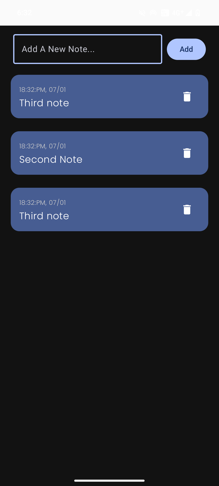

# 📝 Writo

Writo is a clean and minimal Android note-taking application designed to help users create, edit, and manage notes efficiently.  
It focuses on offline reliability, simplicity, and smooth performance using modern Android tools.

---

## 📱 Features

- ✍️ Create and delete notes  
- 💾 Offline storage using Room Database  
- ⚡ Smooth UI with Jetpack Compose  
- 🔄 Automatic UI updates with state management  
- 🎯 Simple and distraction-free design  

---

## 🛠 Tech Stack

- **Language:** Kotlin  
- **UI:** Jetpack Compose  
- **Architecture:** MVVM (Model-View-ViewModel)  
- **Database:** Room Database  
- **State Management:** ViewModel + State  
- **Build System:** Gradle  

---

## 🧱 Architecture

Writo follows the **MVVM architecture pattern**:

- **Model:** Room (Entity, DAO, Database)  
- **View:** Jetpack Compose UI components  
- **ViewModel:** Manages business logic and UI state  

This structure makes the codebase scalable, maintainable, and easy to test.

---

## 📸 Screenshots
<p align="center">
  
  
  
</p>
---

## 📂 Project Structure

```text
com.example.writo
│
├── data
│   ├── NoteEntity.kt
│   ├── NoteDao.kt
│   └── NoteDatabase.kt
│
├── ui
│   ├── screens
│   └── components
│
├── viewmodel
│   └── NoteViewModel.kt
│
└── MainActivity.kt
****

---
```
## 🚀 Getting Started

### Clone the repository
- git clone https://github.com/Tejpalbhardwaj/Writo.git
- Open in Android Studio
- Open the project in Android Studio

Sync Gradle

Run the app on an emulator or physical device

## 👨‍💻 Developer
- Tejpal Bhardwaj
- Android Developer | Kotlin | Jetpack Compose

GitHub: https://github.com/Tejpalbhardwaj
